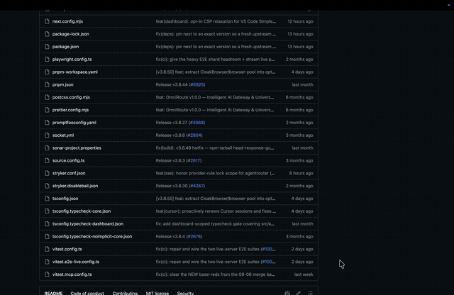
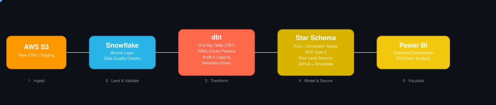

<p align="center">
  
</p>

<p align="center">
  
</p>

<p align="center">
  
  
  
  
  
</p>

---

## 🎬 Live Demo

<p align="center">
  
</p>

<p align="center"><i>Recorded straight from the working report — this is the actual output of the pipeline below, not a mockup.</i></p>

---

## 📌 What This Project Is

A **complete, production-style data engineering pipeline** — not a single notebook, not one flat table someone charted. It's the full journey a real analytics team ships:

> **Raw CSVs in S3 → validated & staged in Snowflake → transformed with dbt into a governed Star Schema → secured with row-level access → visualized live in Power BI.**

---

## 🔄 Pipeline in Motion

<p align="center">
  
</p>

<p align="center"><i>Each dot represents data moving through a real stage of the pipeline — ingestion → warehousing → transformation → modeling → visualization.</i></p>

---

## 🥉🥈🥇 Medallion Architecture

<p align="center">
  
</p>

| Layer | What lives here |
|---|---|
| 🥉 **Bronze** | Raw data landing zone in Snowflake, straight from S3 — with automated data quality checks at intake |
| 🥈 **Silver** | A **One Big Table (OBT)** unifying all sources, built through a **YAML-driven, metadata-based dbt pipeline** with full audit & logging — so new sources plug in without rewriting logic |
| 🥇 **Gold** | A governed **Star Schema** (fact + dimension tables) with **SCD Type 2** for historical tracking, protected by **Row-Level Security** — this is what Power BI actually queries |

---

## 🏗️ Stage-by-Stage Breakdown

| Stage | What happens | Tools |
|---|---|---|
| **1. Ingestion** | Raw Airbnb data lands in an **S3 bucket**; a second bucket handles staging/backup | AWS S3 |
| **2. Bronze Layer** | Data is landed into **Snowflake** as-is, with automated quality checks run at intake | Snowflake, SQL |
| **3. Transform → OBT** | Every source is unified into a **single raw table** before modeling begins | dbt |
| **4. Transform → Metadata Pipeline** | Transformations are config-driven (YAML), not hardcoded — every run is auto-logged and audited | dbt |
| **5. Model → Star Schema** | Fact + dimension tables, optimized for BI performance, with **SCD Type 2** history | dbt, Snowflake |
| **6. Govern** | **Row-Level Security** enforced at the warehouse layer | Snowflake |
| **7. Orchestrate** | Version-controlled and unified through **GitHub + Snowflake** | GitHub |
| **8. Consume** | Powers interactive **Power BI** dashboards — Executive Overview, Revenue Analysis, Booking Insights, Geographical Analysis | Power BI |

---

## 📊 Reference: Report Pages

These two pages are what the demo GIF above walks through — shown here as static reference for the KPIs each page surfaces.

<table>
<tr>
<td width="50%">

**Airbnb Performance Overview**


Total Revenue **62.53M** · Bookings **5K** · Listings **500** · Hosts **189**

</td>
<td width="50%">

**Revenue & Pricing Analysis**


Avg Booking Value **12.51K** · Avg Price/Night **170.32** · Cleaning Fees **250.72K**

</td>
</tr>
</table>

---

## 🧰 Tech Stack

| Layer | Technology |
|---|---|
| Storage / Ingestion | AWS S3 |
| Data Warehouse | Snowflake |
| Transformation | dbt (YAML-driven, metadata-based pipelines) |
| Modeling | Star Schema, SCD Type 2 |
| Security | Snowflake Row-Level Security & Access Control |
| BI / Visualization | Power BI |
| Version Control | GitHub |

---

## ✅ What Makes This "End-to-End"

- 🪣 **Scalable architecture** — raw storage, staging, and warehouse layers cleanly separated
- 🔐 **Secure & governed** — quality checks on intake, RLS on output
- ⚙️ **Automated & reusable** — YAML-driven configs, no hardcoded pipelines
- 🚀 **Optimized for performance** — Star Schema built specifically for fast BI queries
- 📈 **Business insights at scale** — one pipeline, from raw file to executive dashboard

---

## 📂 Repository Structure

```
.
├── Airbnb_Dashboard/
│   ├── Report/                           # Power BI report internals
│   ├── dashboaed view 1.jpeg             # Report page 1 screenshot
│   └── dashboard view 2 .jpeg            # Report page 2 screenshot
├── docs/
│   ├── demo.gif                      # Animated dashboard walkthrough
│   ├── pipeline_flow.svg             # Animated data flow diagram
│   └── medallion.svg                 # Animated Bronze/Silver/Gold diagram
└── README.md
```

---

## 🚀 How to Explore This Project

1. Watch the demo GIF above for the full live walkthrough
2. Review the animated pipeline diagram to see how data moves stage to stage
3. Open `AirbnbPerformanceDashboard.pbix` in **Power BI Desktop**
4. Use the filter panes (City, Property Type, Room Type, Booking Status) to slice the data
5. On the Revenue & Pricing Analysis page, click into the decomposition tree to drill from Total Revenue down through Room Type → Property Type → City

---

<p align="center">
  
</p>
