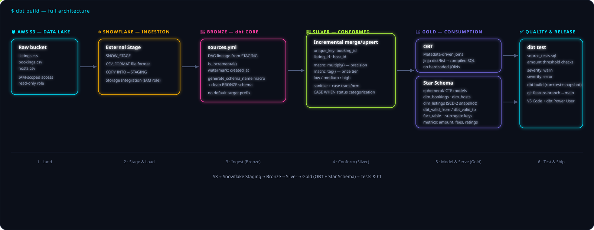

<p align="center">
  
</p>

<p align="center">
  
</p>

<p align="center">
  
  
  
  
  
  
</p>

---

## 📊 At a Glance

<p align="center">
  
</p>

<p align="center"><i>Pulled straight from the Gold-layer Star Schema — the same numbers a downstream BI layer would surface.</i></p>

---

## 📌 Project Overview

This is a **production-style, end-to-end data engineering pipeline** built around a synthetic Airbnb dataset — designed to mirror how a real analytics engineering team ships governed, testable, incrementally-loaded data products.

Raw CSVs (`listings.csv`, `bookings.csv`, `hosts.csv`) land in an **AWS S3** data lake, are securely loaded into **Snowflake** through IAM-scoped external stages, and are transformed through a full **Medallion Architecture (Bronze → Silver → Gold)** in **dbt Core** — culminating in both a metadata-driven **One Big Table (OBT)** and a governed **Star Schema** with SCD Type 2 history tracking.

### Objectives

- ✅ Demonstrate a realistic **Bronze/Silver/Gold** dbt project structure, not a single flat model
- ✅ Show **incremental loading** with watermarking instead of full-refresh anti-patterns
- ✅ Build **reusable Jinja macros** rather than repeating transformation logic across models
- ✅ Implement **SCD Type 2** dimension history using native dbt Snapshots
- ✅ Prove a **metadata-driven pipeline pattern** can generate joins dynamically, without hardcoding SQL
- ✅ Bake in **data quality testing** with configurable severity (`warn` vs `error`)
- ✅ Use modern Python tooling (`uv`) and a clean Git feature-branch workflow

---

## 🔄 Pipeline in Motion

<p align="center">
  
</p>

---

## 🥉🥈🥇 Medallion Architecture

<p align="center">
  
</p>

---

## 🏛️ Architecture Diagram

<p align="center">
  
</p>

<details>
<summary><b>Text version</b></summary>

```
 S3 (listings, bookings, hosts)
        │
        ▼
 Snowflake External Stage (SNOW_STAGE, CSV_FORMAT)
        │  COPY INTO
        ▼
 STAGING schema
        │
        ▼
 BRONZE  (sources.yml · is_incremental() · generate_schema_name)
        │
        ▼
 SILVER  (merge/upsert · macro: multiply() · macro: tag() · CASE WHEN)
        │
        ├──────────────► GOLD · OBT (metadata-driven joins, no hardcoding)
        │
        └──► ephemeral/ CTEs ──► dim_bookings / dim_hosts / dim_listings (SCD-2 snapshots)
                                            │
                                            ▼
                                     fact_table (surrogate keys + metrics)
                                            │
                                            ▼
                                  dbt test / dbt build → git feature-branch → main
```
</details>

---

## 📂 Repository Directory Structure

```
.
├── docs/
│   ├── pipeline_flow.svg
│   └── medallion.svg
├── macros/
│   ├── generate_schema_name.sql       # Custom schema routing (Bronze/Silver/Gold)
│   ├── multiply.sql                   # Mathematical macro with precision handling
│   ├── sanitize_text.sql              # Text cleaning / case transformation
│   └── tag.sql                        # Conditional classification (price tier: low/medium/high)
├── models/
│   ├── sources/
│   │   └── sources.yml                # Upstream source declarations, freshness, DAG lineage
│   ├── bronze/
│   │   ├── bronze_listings.sql
│   │   ├── bronze_bookings.sql
│   │   └── bronze_hosts.sql
│   ├── silver/
│   │   ├── silver_listings.sql        # incremental, unique_key = listing_id
│   │   ├── silver_bookings.sql        # incremental, unique_key = booking_id
│   │   └── silver_hosts.sql           # incremental, unique_key = host_id
│   └── gold/
│       ├── obt/
│       │   └── obt_airbnb.sql         # Metadata-driven One Big Table
│       ├── ephemeral/
│       │   ├── cte_booking_context.sql
│       │   └── cte_listing_context.sql
│       ├── dim_listings.sql
│       ├── dim_hosts.sql
│       ├── dim_bookings.sql
│       └── fact_table.sql
├── snapshots/
│   ├── snap_listings.sql              # SCD Type 2 · timestamp strategy
│   ├── snap_hosts.sql
│   └── snap_bookings.sql
├── tests/
│   └── source_tests.sql               # Singular test: booking amount thresholds (warn/error)
├── dbt_project.yml
├── packages.yml
├── pyproject.toml                     # uv-managed Python 3.12 environment
├── profiles.yml.example               # Template — credentials masked
└── README.md
```

---

## ⚙️ Step-by-Step Setup Guide

### 1. Prerequisites

- Python 3.12+
- [`uv`](https://docs.astral.sh/uv/) package manager
- AWS account with S3 + IAM access
- Snowflake account (`ACCOUNTADMIN` or a role that can create databases/warehouses/stages)
- Git
- VS Code with the **dbt Power User** extension (recommended)

### 2. Local Python Environment (via `uv`)

```bash
# Initialize the project
uv init airbnb-dbt-pipeline
cd airbnb-dbt-pipeline

# Sync the environment
uv sync

# Add dbt Core + the Snowflake adapter
uv add dbt-core dbt-snowflake

# Verify
uv run dbt --version
```

### 3. AWS — IAM & S3 Bucket

```bash
# Create the data lake bucket
aws s3 mb s3://airbnb-raw-data-lake --region ap-south-1

# Upload raw source files
aws s3 cp listings.csv s3://airbnb-raw-data-lake/raw/listings/
aws s3 cp bookings.csv s3://airbnb-raw-data-lake/raw/bookings/
aws s3 cp hosts.csv    s3://airbnb-raw-data-lake/raw/hosts/
```

Create a scoped IAM policy for Snowflake's access role — grant only `s3:GetObject`, `s3:GetObjectVersion`, and `s3:ListBucket` on the specific bucket/prefix, and attach it to a dedicated IAM role that Snowflake assumes via a storage integration. Never use root or broad `s3:*` credentials.

### 4. Snowflake — Database, Schemas, File Format & External Stage

```sql
-- Database & warehouse
CREATE DATABASE IF NOT EXISTS AIRBNB_DB;
CREATE WAREHOUSE IF NOT EXISTS AIRBNB_WH
    WAREHOUSE_SIZE = 'XSMALL'
    AUTO_SUSPEND = 60
    AUTO_RESUME = TRUE;

USE DATABASE AIRBNB_DB;

-- Schemas for each medallion layer
CREATE SCHEMA IF NOT EXISTS STAGING;
CREATE SCHEMA IF NOT EXISTS BRONZE;
CREATE SCHEMA IF NOT EXISTS SILVER;
CREATE SCHEMA IF NOT EXISTS GOLD;

-- Custom file format
CREATE OR REPLACE FILE FORMAT STAGING.CSV_FORMAT
    TYPE = 'CSV'
    FIELD_DELIMITER = ','
    SKIP_HEADER = 1
    FIELD_OPTIONALLY_ENCLOSED_BY = '"'
    NULL_IF = ('NULL', 'null', '');

-- Storage integration (created once by an account admin)
CREATE STORAGE INTEGRATION IF NOT EXISTS S3_AIRBNB_INTEGRATION
    TYPE = EXTERNAL_STAGE
    STORAGE_PROVIDER = 'S3'
    ENABLED = TRUE
    STORAGE_AWS_ROLE_ARN = 'arn:aws:iam::<ACCOUNT_ID>:role/<snowflake-access-role>'
    STORAGE_ALLOWED_LOCATIONS = ('s3://airbnb-raw-data-lake/raw/');

-- External stage
CREATE OR REPLACE STAGE STAGING.SNOW_STAGE
    URL = 's3://airbnb-raw-data-lake/raw/'
    STORAGE_INTEGRATION = S3_AIRBNB_INTEGRATION
    FILE_FORMAT = STAGING.CSV_FORMAT;

-- Initial load into STAGING
COPY INTO STAGING.LISTINGS
    FROM @STAGING.SNOW_STAGE/listings/
    FILE_FORMAT = (FORMAT_NAME = STAGING.CSV_FORMAT)
    ON_ERROR = 'CONTINUE';
```

### 5. dbt `profiles.yml` Template (credentials masked)

```yaml
airbnb_dbt_pipeline:
  target: dev
  outputs:
    dev:
      type: snowflake
      account: "<ORG-ACCOUNT_LOCATOR>"
      user: "<DBT_SERVICE_USER>"
      password: "{{ env_var('SNOWFLAKE_PASSWORD') }}"
      role: "TRANSFORMER_ROLE"
      database: "AIRBNB_DB"
      warehouse: "AIRBNB_WH"
      schema: "BRONZE"
      threads: 4
      client_session_keep_alive: false
```

> 🔐 Never commit real credentials. Use environment variables or a secrets manager, and keep `profiles.yml` out of version control (`~/.dbt/profiles.yml`, not inside the repo).

### 6. Git Feature-Branch Workflow

```bash
git switch -c feature/gold-star-schema
# ...make changes...
git add .
git commit -m "feat(gold): add dim_listings SCD-2 snapshot + fact_table"
git switch main
git merge feature/gold-star-schema
```

---

## ▶️ Pipeline Execution Commands

| Command | Purpose |
|---|---|
| `uv run dbt debug` | Verify connection to Snowflake and validate `profiles.yml` |
| `uv run dbt deps` | Install any packages declared in `packages.yml` |
| `uv run dbt compile` | Compile Jinja/SQL models without executing them — good for reviewing generated SQL |
| `uv run dbt run` | Execute all models (Bronze → Silver → Gold) in DAG order |
| `uv run dbt run --select bronze+` | Run Bronze models and everything downstream |
| `uv run dbt snapshot` | Execute SCD Type 2 snapshots for `dim_listings`, `dim_hosts`, `dim_bookings` |
| `uv run dbt test` | Run schema + singular tests, including `source_tests.sql` severity checks |
| `uv run dbt build` | Run + test + snapshot in correct DAG order in a single command |
| `uv run dbt clean` | Remove `target/` and `dbt_packages/` artifacts |

---

## 🧠 Core Engineering Concepts

### SCD Type 2 via dbt Snapshots
`dim_listings`, `dim_hosts`, and `dim_bookings` are built as **Slowly Changing Dimension Type 2** tables using native dbt `snapshot` blocks with the `timestamp` strategy. Every change to a tracked column inserts a new row rather than overwriting history, with `dbt_valid_from` and `dbt_valid_to` marking the active time range — so "what did this listing's price tier look like on a given date" is always answerable.

### Metadata-Driven Pipelines vs. Hardcoded Joins
The **Gold-layer OBT** is not a wall of hardcoded `JOIN` statements. Instead, a Jinja dictionary/list defines each source table, its alias, the columns to select, and its join condition — and a `for` loop compiles the final `SELECT`/`JOIN` SQL at compile time. Adding a new source table means adding a metadata entry, not rewriting SQL.

### Incremental Upserts
Silver-layer models use `materialized='incremental'` with a `unique_key` (`booking_id`, `listing_id`, `host_id`) so dbt generates a `MERGE` statement — updating changed rows and inserting new ones — instead of reprocessing the full history on every run. Bronze-layer incrementality is watermarked on `created_at` via `is_incremental()`.

### Custom Schema Resolution
The `generate_schema_name` macro overrides dbt's default `<target_schema>_<custom_schema>` behavior so Bronze, Silver, and Gold models land in **clean, prefix-free schemas** (`BRONZE`, `SILVER`, `GOLD`) regardless of the dbt target — keeping the warehouse layout predictable across dev/prod.

### Data Quality & Testing
`tests/source_tests.sql` is a **singular test** asserting boundary conditions (e.g., booking amount must fall within a sane range). Severity is configurable per test — `severity: warn` surfaces issues without failing the build, while `severity: error` blocks a `dbt build` from succeeding, letting the team decide which checks are advisory vs. release-blocking.

---

## 🧰 Tech Stack

| Layer | Technology |
|---|---|
| Storage / Ingestion | AWS S3, IAM |
| Data Warehouse | Snowflake (External Stages, Storage Integration, COPY INTO) |
| Transformation | dbt Core (macros, incremental models, snapshots) |
| Modeling | Medallion (Bronze/Silver/Gold), OBT, Star Schema, SCD Type 2 |
| Testing | dbt singular + schema tests, configurable severity |
| Environment | Python 3.12, `uv` |
| Editor | VS Code / Antigravity + dbt Power User |
| Version Control | Git (feature-branch workflow) |

---

## ✍️ Author & License

**Author:** Vamshi
Built as an end-to-end data engineering portfolio project demonstrating production dbt/Snowflake/S3 patterns.

**License:** MIT — free to use, adapt, and learn from. See `LICENSE` for details.

---

<p align="center">
  
</p>
